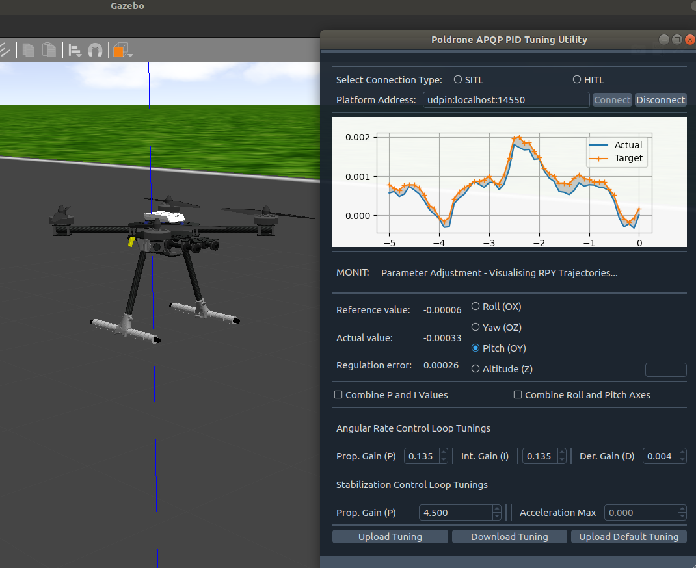

# PID Tuning Utility for Ardupilot UAVs





## About 
This is a simple PyQt app for PID Tuning for Quadcopters and Quadplanes running Ardupilot firmware. 

The idea is to visualize the values of RPY + Altitude and adjust corresponding PID gains in the same interface. **All that having in mind only one single rule of thumb - the less gray area on the screen - the better regulation quality.**

The increments on the PID values are taken directly from the Ardupilot documentation, and the app currently allows you to tune both the RATE and STAB loops on RPY. Altitude control loop tuning is not yet supported.

This is a working demo of the project. It was tested on an actual quadplane platform (branch v3, running with custom AP firmware) and SITLs - both the built-in MissionPlanner one and its exposed version (`sim_vehicle.py`) interfaced with Gazebo 9. 


## Acknowledgements

Many thanks to J. Szawara from PolDrone Autonomous Technologies for the project idea, general guidance, help with preliminary testing and review of the implementation in context of needed features.


## Installation ( ¯\\ _ (ツ) _ /¯ )

As for now there are no releases yet, as the app is still in early development. There is a conda environment provided alongside the codebase to make sure that the app runs on your machine too.

You easily can run and modify the app in accordance to your needs by following these steps:

1. Clone this repository.

2. Download Anaconda: [click here](https://www.anaconda.com/download/success). On Windows, install for a single user, and make sure to check ADD CONDA TO PATH when prompted. 

3. Navigate to the root directory of the repository. When inside install the provided environment. You can do it from Anaconda Navigator (left navbar "Environments"-> Bottom Menu "Import" Tab) or through CLI, first navigate to the root directory of the cloned repository, then run:

```sh
conda env update --name pid-pyqt-env --file .\pid-pyqt-env.yaml
```

4. Remaining in the root directory of the repository, activate the environment (just once):

```sh
conda activate pid-pyqt-env
```

5. Then run the app:
```sh
python .\main.py
```


